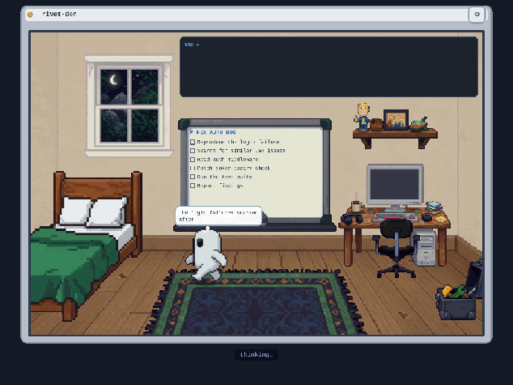

# rivet-den — watch your agent work

A live pixel-art diorama of an agent session. Lifecycle hooks translate what
the agent is doing — prompts, tool calls, plans, thinking, compaction — into
a small event protocol; a tiny server reduces those events into room state;
a Pixi viewer renders the room: whiteboard plans get written, the terminal
shows real commands, the robot walks to the desk to code, and context
compaction is a nap in the bed.



## Quickstart

```bash
npm install
npm run build -w @rivetos/den-protocol -w @rivetos/den-packs \
              -w @rivetos/den-server   -w @rivetos/den-app

RIVETOS_DEN_STATIC_DIR=apps/den/dist \
RIVETOS_DEN_PACKS_DIR=packages/den-packs/packs \
node services/den-server/dist/index.js
# → http://127.0.0.1:5174/demo  (built-in demo loop, no agent needed)
```

To stream a real session, install an adapter:

- **Claude Code** — add the `rivet-den` plugin from the rivetos marketplace
  (`integrations/claude-code/rivet-den/`); set `RIVET_DEN_URL` if the server
  isn't on localhost. [Plugin README](../integrations/claude-code/rivet-den/README.md)
  — read its "What the den shows" section before pointing it at a shared server.
- **Grok Build** — hook set in `integrations/grok/rivet-den/`.

The server binds `127.0.0.1` by default; set `RIVETOS_DEN_HOST=0.0.0.0` (and
ideally `RIVETOS_DEN_TOKEN`) to serve a LAN. Multiple viewers, multiple
sessions, one server — the picker chooses which room drives the den.

## The moving parts

| Doc | What it covers |
|-----|----------------|
| [PROTOCOL.md](../packages/den-protocol/PROTOCOL.md) | The v1 event schema and reducer semantics — the frozen contract everything else builds on |
| [PACK.md](../packages/den-packs/PACK.md) | SpritePack spec: poses, furniture, stations, composite art, functional rects, `viewer{}` tuning |
| [ART-PIPELINE.md](../packages/den-packs/ART-PIPELINE.md) | How default-pack@2's art was made with an image generator — the magenta studio, union-crop alignment, analytic anchor solving. Start here if you want to author a pack; it's the fun one |
| [den-server](../services/den-server/src/server.ts) | Ingest (`POST /events` ordered batches), WS fanout, snapshots, eviction |

Default pack weighs ~8.6MB of pre-keyed PNGs served once and cached;
`grid.pxPerUnit: 2` keeps textures small and the render cheap.

## Mesh view

One den-server runs per node; `GET /mesh.json` (auth-gated like every other
endpoint) is how a viewer sees them all. The server reads the mesh roster —
`RIVETOS_DEN_MESH_FILE` if set, else `/rivet-shared/mesh.json`, else
`~/.rivetos/mesh.json` — projects the den-enabled nodes, probes each one's
den `/healthz` in parallel (1.5s budget per peer), and answers:

```json
{
  "updatedAt": 1751600000000,
  "nodes": [
    { "id": "rivet-claude", "name": "rivet-claude",
      "denUrl": "http://192.0.2.10:5174", "online": true, "sessions": 2,
      "latest": { "activity": "coding", "title": "wiring the mesh view" } }
  ]
}
```

The whole result is cached for `RIVETOS_DEN_MESH_CACHE_MS` (default 10s).
`latest` appears only on the entry that is this process — `RIVETOS_DEN_NODE_ID`
(else the machine hostname) matched against roster node ids; when nothing
matches, no entry carries a `latest`, which is fine. The endpoint is `/mesh.json`
*with* the extension on purpose: the extensionless `/mesh` stays free for the
viewer SPA's route.

A node is den-enabled when its roster entry has `'den'` in `capabilities`, a
`metadata.denPort`, or a full `metadata.denUrl` (http/https only — anything
else is ignored with a warning). The entry's top-level `port` is the agent
channel, **not** the den, which is why the den port lives in metadata:

```json
"rivet-claude": {
  "capabilities": ["den"],
  "metadata": { "denPort": 5174 }
}
```

On RivetOS nodes this tagging is automatic: when the node's config has
`den.enabled: true`, the runtime's mesh self-registration includes `'den'` in
`capabilities` and `metadata: { denPort: <den.port> }` on every startup
(`buildLocalNode()` call in `packages/boot/src/registrars/agents.ts`). That
makes den discovery restart-proof by construction —
`FileMeshRegistry.register()` wholesale-replaces the node's roster entry, and
the replacement is always derived from config.

Hand-tagging is the fallback for den hosts the runtime doesn't own: non-RivetOS
machines running a den-server, infra-role entries, hand-maintained nodes. Do
not hand-tag a runtime-owned entry — the next restart rebuilds it from config
and the edit evaporates (that is the feature; put the truth in the node's
`den:` config section instead). (`rivetos mesh join` still registers a fresh
empty-capability entry under a newly generated UUID id, which is its own kind
of roster noise, unrelated to den.)

## Deploying with RivetOS

On mesh nodes the den is config-driven: add a `den:` section to
`~/.rivetos/config.yaml` and run `rivetos update` (or `rivetos update --mesh`
from any node — each node's own config decides what it gets).

```yaml
den:
  enabled: true            # deploy rivet-den.service + advertise this node's den
  host: 0.0.0.0            # default 127.0.0.1 (loopback fail-safe)
  port: 5174               # default
  token: <bearer-token>    # REQUIRED when terminal.enabled and host isn't loopback
  terminal:
    enabled: true          # local PTY terminals — off by default
  # static_dir: /opt/rivetos/apps/den/dist            # defaults derived from
  # packs_dir: /opt/rivetos/packages/den-packs/packs  # the install root
```

What the update's den stage does on a den-enabled node (locally, and over SSH
for mesh peers — honoring per-node `sshUser`; non-linux platforms are skipped
like the rest of the update):

1. builds `services/den-server` (workspace build — usually an nx cache hit),
2. installs/refreshes `/etc/systemd/system/rivet-den.service` from
   `services/den-server/rivet-den.service`,
3. **generates** `~/.rivetos/den.env` from the `den:` section (host, port,
   token, terminal flag, static/packs dirs). The file is config-managed —
   its header says so, it is chmod 600 because the token lives there, and
   hand-edits are overwritten on the next update. Change `config.yaml`, not
   `den.env`,
4. runs `npm rebuild node-pty` when `terminal.enabled` (see the ABI runbook
   below); a missing toolchain degrades to a warning,
5. restarts `rivet-den.service` and probes `http://localhost:<port>/healthz`.

Misconfigurations — most importantly terminals exposed off-loopback without a
token — are rejected by `rivetos config validate` before any of this runs;
the validator mirrors den-server's own startup security gate.

When `den.enabled` is false/absent but a `rivet-den.service` is already
active, the update leaves it alone and prints a notice — no surprise
teardowns. Retiring a den is an operator action:
`sudo systemctl disable --now rivet-den`.

A failed den stage never fails the node's rivetos update (den is auxiliary);
it shows up as `⚠den` in the mesh summary table — check
`journalctl -u rivet-den` on the node.

Hosts that aren't RivetOS installs can still run a den-server by hand: build
the workspace, copy the unit, write `den.env` yourself, and tag the mesh
entry manually (see "Mesh view" above — manual tags survive only on entries
the runtime doesn't own).

### node-pty ABI runbook

`node-pty` (the terminal backend) is a native module: its compiled binary
must match the node binary that runs the service — the unit's
`ExecStart=/usr/bin/node`. An `npm install` done under a different node (nvm,
asdf, homebrew) leaves a mismatched binary and every term endpoint answers
503. The deploy stage rebuilds it with `/usr/bin` first on PATH so npm runs
under the same node the unit uses. Verify on the node with:

```bash
cd /opt/rivetos && /usr/bin/node -e "require('node-pty').spawn('true',[],{});console.log('ok')"
```

Prints `ok` → the ABI matches. A `NODE_MODULE_VERSION` error → rerun
`cd /opt/rivetos && PATH=/usr/bin:$PATH npm rebuild node-pty`. A node-gyp
toolchain error → install `make`, `g++`, `python3`, then re-run
`rivetos update` (until then the den runs fine with terminals answering 503).

**Never rsync `node_modules` across nodes or architectures.** A
`node_modules` copied from an x86 node to an ARM one (or across glibc/node
versions) carries native binaries that won't load — node-pty is exactly the
kind of dependency that breaks. On mixed-arch meshes every node runs its own
`npm install` and its own node-pty rebuild, which is precisely what
`rivetos update` does; don't shortcut it with file sync.

### Terminal roster + security model

Terminals are the den's sharpest edge — a shell running as the service user
behind HTTP — so the whole model in one place:

- **Off by default.** `den.terminal.enabled: true` is a deliberate act, per
  node.
- **Token gate.** Off loopback, a bearer token is mandatory. The config
  validator refuses the config at deploy time, and den-server re-checks at
  startup and force-disables terminals (loudly) if the state is ever reached
  anyway.
- **Trusted-network opt-out.** `den.terminal.open: true` explicitly waives the
  token requirement — for private LANs where convenience wins. Understand what
  it means: anything that can reach the port can spawn a shell as the service
  user. den-server logs the open state at startup; it is never the default.
  (`token:` can then be omitted entirely — the whole den runs unauthenticated,
  like the pre-2.0 prototype did.)
- **Roster ownership.** The HTTP API accepts only command *keys* from the
  operator-owned roster (`~/.rivetos/den-term.json`); argv/cwd/env never
  travel over the wire in either direction, and every command is spawned
  directly from its argv array — never through a shell. The roster is re-read
  lazily, so edits need no restart. Unlike `den.env`, the roster file is
  yours: the update never writes it.
- **Audit log.** Every spawn/kill/exit appends a JSON line to
  `~/.rivetos/den/term-audit.log` (`$RIVETOS_DEN_STATE_DIR/term-audit.log`).

Sample `~/.rivetos/den-term.json`:

```json
{
  "default": "claude",
  "cwd": "/home/rivet",
  "commands": {
    "claude": { "label": "Claude Code", "cmd": ["claude"], "room": true },
    "grok":   { "label": "Grok Build", "cmd": ["grok"], "room": true },
    "shell":  { "label": "Shell", "cmd": ["bash", "-l"], "room": false }
  }
}
```

`room: true` marks den-aware harnesses (they get a synthetic `session.end` if
the process exits without one); `room: false` is for plain processes. See the
[den-server README](../services/den-server/README.md) for the full roster
shape (per-entry `cwd`/`env`) and the PTY knobs.

## Mobile & performance

The viewer runs fine on phones (it camera-follows the character in portrait).
Two honest notes: Pixi renders every animation frame, so a den left open in
the foreground will use battery like a game would — background tabs throttle
to nothing. On weak GPUs prefer the day shell (`?tod=day`) and one session
per tab. There is no reduced-motion mode yet.

## Accessibility

The chat stream and narration panel are DOM text (screen-reader reachable);
the room itself — whiteboard, terminal, activity — is canvas and currently
invisible to assistive tech. Future polish: mirror whiteboard/terminal state
into an `aria-live` region and honor `prefers-reduced-motion`.

## Roadmap

- **rivetos-native emitters** — events straight from the runtime's hook
  pipeline (no CC/Grok adapter needed); next PR after this stack lands.
- **Visual regression on packs** — render each pose/station headlessly and
  diff against goldens, so art and anchor changes surface in review.
- **Hosted den tier** — the CC plugin is deliberately self-contained (plain
  Node, no rivetos install) so a hosted server + token is a copy-paste onboard.
- **Pack marketplace** — `den-pack validate` is already the gatekeeper;
  spec v1 is frozen; PACK.md is the authoring contract.

## Gateway (G0–G7)

The den server is embedded in the rivetos process as the per-node gateway
(`/api/tasks`, `/api/catalog`, `/api/sessions`, plus `/api/events|mesh|terminal`
aliases). Two G7 knobs:

- **Serving a different web app at `/`** (e.g. rivethub-web in phase 4): set
  `den.static_dir` to the built app's directory — the SPA fallback serves it
  for every non-API path.
- **Binding :80/:443 directly** (no reverse proxy): run `rivetos gateway caps`
  once (installs a systemd drop-in granting `CAP_NET_BIND_SERVICE` as an
  ambient capability — note that processes the agent spawns, including den
  terminals, inherit it), set `den.port: 443`, restart. `rivetos gateway token` prints the bearer token
  for non-loopback clients when `den.token: gateway-token-file` is set.
